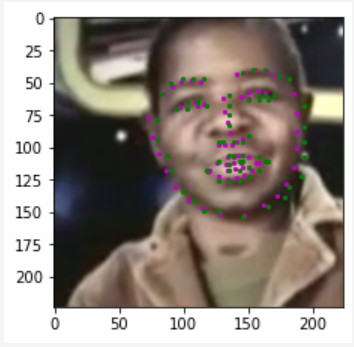
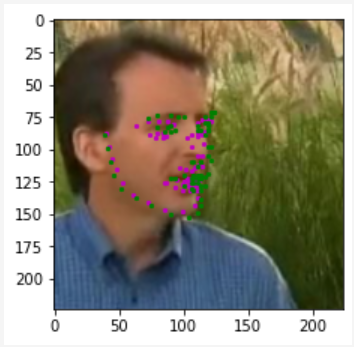
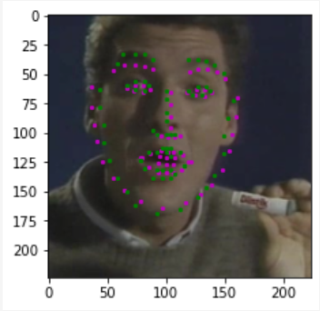
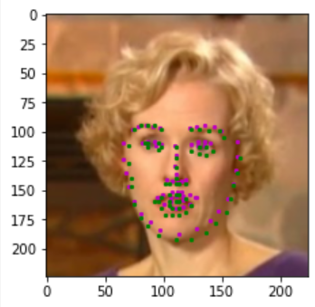
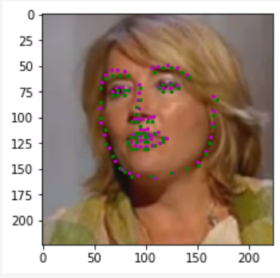
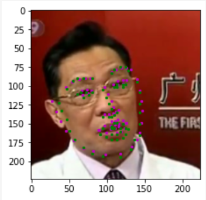
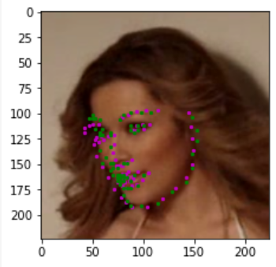
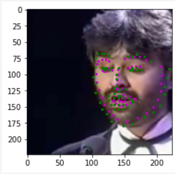

# Facial Keypoint Detection

[//]: # (Image References)

  

  

## Project Overview
This project is an extension of the Facial Keypoint project from Udacity's Computer Vision Nanodegree. For this project the youtube faces dataset was used to train a Convolutional Neural Network (CNN) to learn 68 distinct landmarks upon a face. The trained model is then used to create some interesting face filters, using the locations of the eyes, nose, mouth, and jawline. 

## Approaches

#### Model 
Some early experimenting with CNNs trained from scratch provided meager results and revealed that this is a fairly challenging problem. The next approach was to experiment with transfer learning. After some more experimenting, Resnet50 seemed to provide the best results, Resnet101 did not seem to provide any improvement. The only type of model used was a resnet wince it was able to provide adequate results on validation data and out of sample data from a webcam capture. The final resnet had it's fully connected layer completly replaced with 136 outputs for each of the keypoints. During training, layer 4, avg pool, and the fully connected layer were the only ones updated. Experimenting with other layer updates didn't seem to increase or decrease performance on the validation set.

#### Training
The training data was augmented with rotations and color jitter to help the model generalize better, then the images were resized and randomly cropped to 224x224. To help the network train better, the images were normalized with Image Net mean and standard deviation, however the keypoint locations were not normalized. Experimenting with normalized keypoints may lead to better results and/or faster training, but this approach was not persued. 

The first 10 epochs of training were on lightly augmented data (i.e. minor color jitter, minimal random rotations, resize and crop transforms unlikely to remove portions of faces). After 10 epochs the model was able to acheive good results on validation data. The purpose of this was to get the model into a good starting point on easier data, before training on heavily augmented data. The results after 10 epochs are shown below

The final 50 epochs were trained on more heavily augmented data (i.e. larger color jitter, +/1 180 degree random rotations, resize and crop transforms likely to remove portions of faces). The purpose of this secondary training was to fine tune the model to generalize to a variety of image conditions and face angles. An example of a heavily augmented image is shown below.

As a part of initial experiments, a simple model was trained on grayscale images. Results were good, but color images are preferred since they feed the model 3 channels of information, rather than just one.

## Results
Some validation results from the final trained model with the lowest validation loss are shown below:

The truth keypoints are in green and the predicted keypoints are in magenta.

The trained model is able to consistently identify facial keypoints in the validation images under a variety of lighting conditions. Even when the facial features are not directly captured (i.e. looking to the side), the model is able to line up the key points with decent accuracy, although it isn't very consistent with this. 

The results from a webcam capture are shown below

In this case, the model tends to extend the jawline outside of the face, but follows the face as it moves throughout the frame. The glasses don't seem to have an effect on the model's ability to detect the eye locatons.

## Face filters

An basic 'snapchat' filter of a googly orange was built using the key points which can be seen below. The flucations of the predicted facial landmarks are apparent as the orange and googly eyes change sizes.

## Future work
Future work could involve fine tuning the model on some even more heavily augmented data. Image blurring and Image warping (along with keypoint transformation) would be good additions to the already augmented data. Another approach would be to modify the pipeline by first using a Haar face detector to crop the face from each image, and then apply the facial keypoint model to the cropped image. This would provide a more consistent distribution/space/domain for the model to learn instead of having to learn keypoints at a variety of distances. This consistent domain for the model to learn may increase accuracy and consistency (i.e. less random flucuations of keypoint locations). However the pipeline now involves a Haar face detector that requires parameter tuning. An alternative approach would be to use the opencv2 Face dnn instead.

Another simple update to the pipline would be to add histogram equaliztion (via YUV color space) to better account for different lighting conditions.

     

## Sources
- Getting Started: https://github.com/udacity/P1_Facial_Keypoints
- Transfer Learning: https://debuggercafe.com/advanced-facial-keypoint-detection-with-pytorch/
